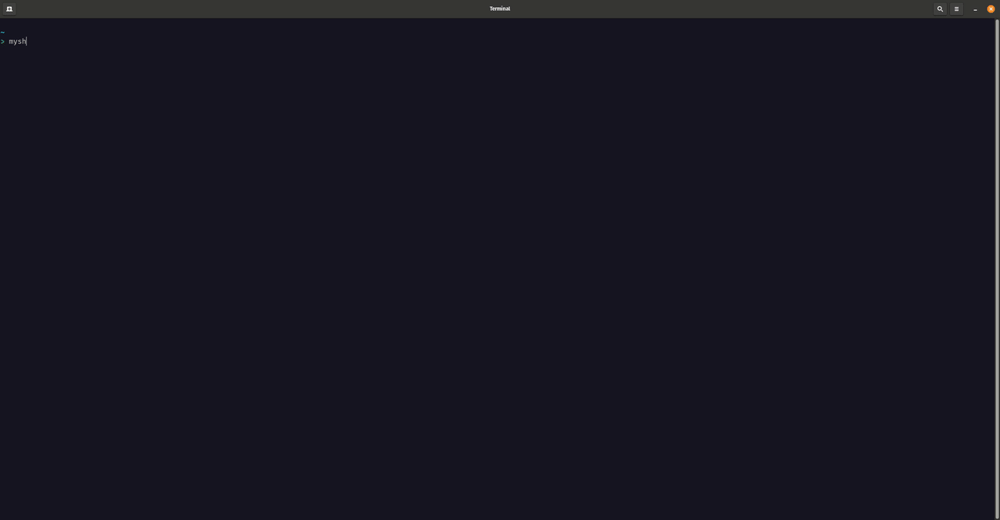

# MyShortcuts

**MyShortcuts** is an interactive terminal user interface (TUI) application for managing shell command and databases connections.

The tool offers the following features :
- Save database connections and shell command
- Edit database connections and shell command
- Formats your configurations and generates a shell command (see [Available Scheme](https://github.com/LugolBis/MyShortcuts/new/main?filename=README.md#available-scheme))
- Open a new terminal and execute a shell command on it
<br>



<br>

## Getting started

### Install with ```cargo``` (recommanded) :
```Bash
$ cargo install --git https://github.com/LugolBis/MyShortcuts.git
```

### Linux/macOS - Bash :
Clone the repository :
```Bash
$ git clone https://github.com/LugolBis/MyShortcuts.git
```
Configure the project :
```Bash
$ cd MyShortcuts && make bash
```
Launch it :
```Bash
$ myshortcuts
```
### Linux/macOS - Zsh :
Clone the repository :
```Bash
$ git clone https://github.com/LugolBis/MyShortcuts.git
```
Configure the project :
```Bash
$ cd MyShortcuts && make zsh
```
Launch it :
```Bash
$ myshortcuts
```

### Windows
Clone the repository :
```Powershell
$ git clone https://github.com/LugolBis/MyShortcuts.git
```
> [!NOTE]
> You can easily configure a powershell alias by yourself to ```cd``` in MyShortcuts dir and launch it with ```cargo run```.

## Available Scheme
**MyShortcuts** integrate predefined schemes for the databases connection. These schemes help you to adding and editing a new database connection by provide you the configuration needed by any of them.
Moreover these schemes are used to format your configuration and generate a shell command with your arguments and the correct flags.
||System|Kind|
|:-|:-:|:-:|
||Oracle|Database connection|
||MySQL|Database connection|
||MariaDB|Database connection|
||PostgreSQL|Database connection|
||SQLite|Database connection|
||Redis|Database connection|
||MongoDB|Database connection|
||Neo4j|Database connection|
||Custom|Shell command|

<br>

> [!NOTE]
> **Custom** scheme support any shell command.

> [!TIP]
> Database connection schemes allow you to specify a script path to run in the database (this option runs your script in your database and does not persist the connection).

## Compatibility
|OS|Shell|Supported|Requirements|
|:-:|:-:|:-:|:-:|
|Linux/macOS|Bash|✅​|[Requirements](https://github.com/LugolBis/MyShortcuts/edit/main/README.md#Bash-)|
|Linux/macOS|Zsh|✅​|[Requirements](https://github.com/LugolBis/MyShortcuts/edit/main/README.md#zsh-)|
|Windows|PowerShell|✅​|[Requirements](https://github.com/LugolBis/MyShortcuts/edit/main/README.md#powershell-)|

## Requirements
### Linux/macOS :
#### Bash :
- [Tmux](https://github.com/tmux/tmux)
- Cargo ([see Cargo.toml](https://github.com/LugolBis/MyShortcuts/blob/main/Cargo.toml))
#### Zsh :
- [Tmux](https://github.com/tmux/tmux)
- Cargo ([see Cargo.toml](https://github.com/LugolBis/MyShortcuts/blob/main/Cargo.toml))

### Windows :
#### Powershell :
- Cargo ([see Cargo.toml](https://github.com/LugolBis/MyShortcuts/blob/main/Cargo.toml))

## Privacy
**MyShortcuts** save your data locally with SQLite, don't worry about saving your passwords !
